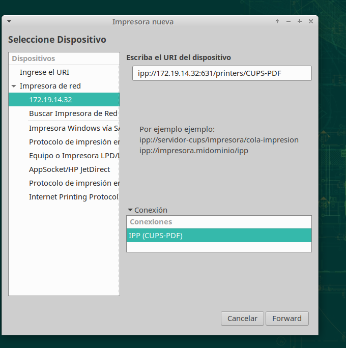

# Impresión cups

Comprobaremos que esta instalado **Cups**

## Impresión local.

Haciendo uso del video que el profesor nos ha dejado en la descripción de la practica para configurar Cups.

Abriremos el cortafuegos.

Conectaremos con la interfaz de cups.

Entramos en la sección archivo de registro de accesos.

Comprobaremos que esta la impresora de PDF.

Haremos una prueba de impresión Local.

## Compartir en red

Luego iremos a las propiedades de la impresora y el estado le daremos a compartir.

Luego añadiremos una impresora para ello iremos a impresora en red y buscaremos la IP del servidor.

La añadimos.

Creamos un documento.

Lo mandamos a imprimir.

Comprobamos.

