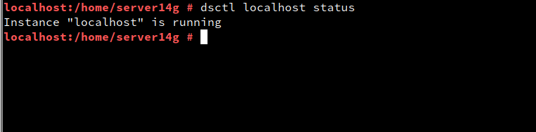
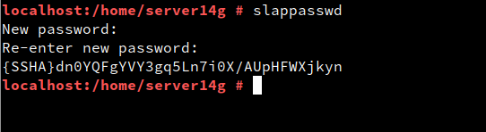

# Servicio de Directorios con comando

## 1º

Crearemos una maquina "openSUSE", que servirá de servidor "LDAP".

Revisamos el fichero **/etc/hostname**, en el añadiremos el nombre "FQDN" ***Server14g.curso2122***

> lei la practica y la hice tal cual, por eso se ve con curso2021

y revisamos el fichero *"hosts"*, con la configuración necesaria y comprobaremos la salida usando:

~~~
hostname -a
hostname -d
hostname -f
~~~

>Trate de que saliera hostname -d, pero por algún motivo fue totalmente imposible.

## 2º
Instalaremos los paquetes que LDAP en este caso es 389-ds y usando:
~~~
rpm -qa | grep 389-ds
~~~
Comprobaremos su versión.

Crearemos el fichero "/root/instance.inf" con el siguiente contenidos.

luego de comprobar que todos los parametros estan correctos (Hablando desde la experiencia),
crearemos una nueva instancia usando el siguiente comando:

~~~
dscreate from-file /root/instance.inf
~~~

y luego comprobamos el estado actual de la instancia usando

~~~
dsctl localhost status
~~~

El mensaje nos indica que todo esta bien.

Despues crearemos el fichero "/root/.dsrc"
con el contenido:

Ahora comprobaremos el servicio, para ello usaremos:
~~~
systemctl status dirsrv@localhost
nmap -Pn server14g | grep -P '389|636'
~~~
Con esto comprobamos tanto si el servicio esta en ejecución, como comprobar que el servidor ldap esta accesible en red.

Ahora para terminar con las comprobaciones y pasar al siguiente punto, comprobaremos el contenido usando "ldapsearch" y los comandos descritos en la practica.

## 3º

Lo primero vamos a comprobar que las OU estan creadas par ello usaremos el siguiente conjunto de comandos.

~~~
ldapsearch -H ldap://localhost:389 \
           -W -D "cn=Directory Manager" \
           -b "dc=ldap14,dc=curso2021" "(ou=*)" | grep dn
~~~

Ahora crearemos un fichero con el nombre ***mazinger-add.ldif***, esto sirve para crear usuarios, dentro del fichero añadiremos lo siguiente.

Con estos parametros correctamente colocados, lo añadiremos usando el siguiente comando.

En el usuario "Mazinger", podemos ver que el apartado "*userPassword*" vemos que aparece {CLEARTEXT} esto indica que la contraseña es un texto plano, esto es un problema ya que, es muy inseguro ante ataques, para ello descargaremos el paquete "**slappasswd**" esto nos permite crear contraseña cifradas tanto en ***SSHA*** como en ***MD5***.

Creamos una contraseña de prueba.

Como se puede ver, nos ha creado una contraseña cifrada.

Ahora crearemos tres usuarios más usando contraseñas cifradas.

*KOJI*

*Boss*

*DR*

Y los añadimos.

