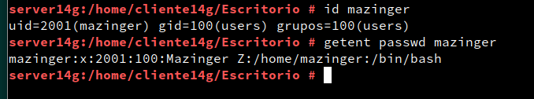

# Cliente para autenticación LDAP

Lo primero que deberemos hacer es configurar LDAP en la maquina cliente, para ello en yast nos debe aparecer LDAP y Kerberos, en caso de que no ocurra, deberemos instalar **yast2-auth-client**.

Antes de continuar deberiamos incluir nuestra maquina servidor en el fichero */etc/hosts*.
Ahora configuramos LDAP.

En el apartado de ubicacion de red debemos añadir nuestro servidor LDAP y ver que funciona para ello daremos a la opción, "probar conexión".

Si esta todo correcto nos dara el mensaje anterior.

Luego de una correcta configuración trataremos de buscar el usuario Mazinger.

He iniciaremos sesión.

Ahora crearemos un nuevo usuario usando los comandos que se reflejan en la captura.

Comprobamos su existencia.

Iniciamos sesión en el cliente.

