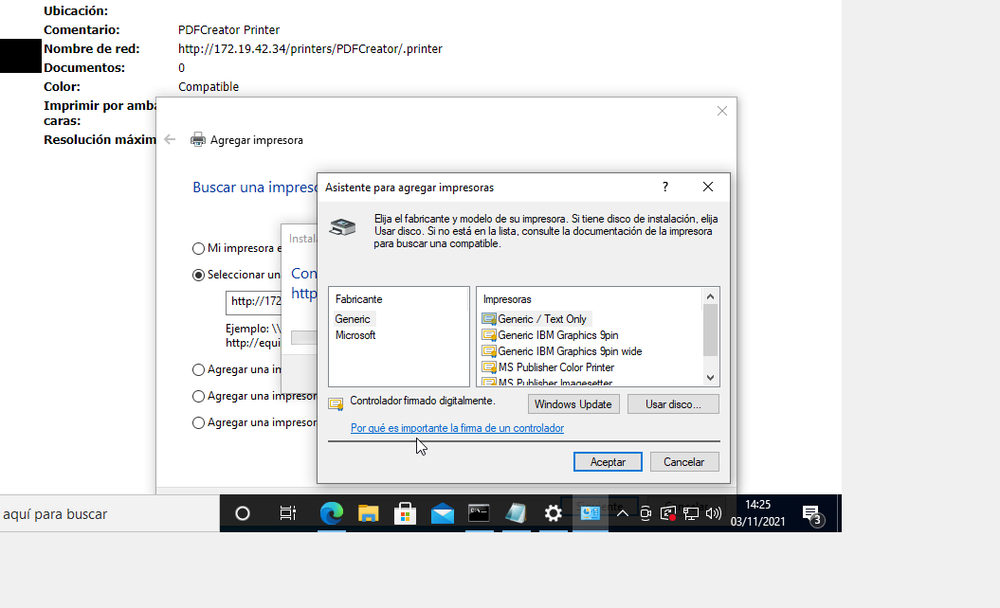

# Servidor de Impresión en Windows

>Nota 1: Esta practica tiene muchos cambios, muchas cosas no funcionaban correctamente y hay muchos pasos adelante y muchos pasos hacia atrás, Todos los puntos han sido completados con distintos "Softwares" e incluso, sistemas operativos, Tambien hay IP´s distintas ya que se ha variado la practica entre clase y casa.

Para empezar crearemos una maquina servidor, en el instalaremos el rol, servidor de Impresión.

Ahora instalaremos una impresora de PDF.
>La impresora a lo largo de la practica a cambiado.

Ahora crearemos un texto para imprimir en local.

Comprobamos en la carpeta de destino anteriormente mencionada.

## Compartir en red

Ahora Compartiremos en red, para ello primero iremos a administración de impresión, elegiremos la impresora de PDF, iremos a propiedades, al apartado compartir y en esa sección le daremos compartir.

Luego iremos al cliente agregaremos la impresora. (la captura define la forma tradicional de agregarlo, otra forma de hacerlo es en el escritorio crear un acceso directo al recurso en red y conectar.)

Al igual que antes crearemos un TXT y lo mandaremos a imprimir.

Comprobaremos.

## Acceso web

Ahora cambiamos de impresora ya que la anterior no funciona bien en este punto.

Antes de nada comprobaremos que en el servidor esta el servicio impresora internet, y lo instalamos. Al hacerlo, iremos al cliente, navegador y en el realizaremos lo siguiente:  
Entraremos con ip-servidor/printers, si esta todo correcto nos saldrá un inicio de sesión para poder entrar.

Al entrar nos aparecerá las impresoras que tenemos, iremos a propiedades de la impresora.

Luego en el cliente iremos a agregar impresora y añadiremos el nombre de red que esta definido en las propiedades de la impresora en el apartado "seleccionar una impresora compartida por nombre"

Instalamos lo que necesita.

>No se pudo comprobar la impresión ya que, imprime pero no aparece en cola.

