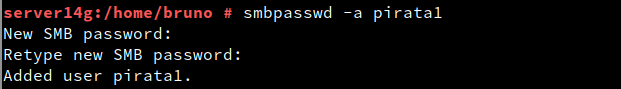
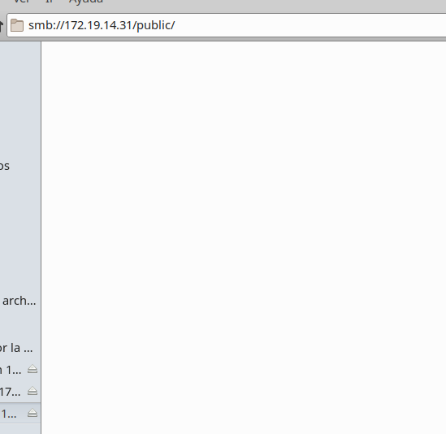

# Samba (con OpenSUSE y Windows)
Samba es una implementación libre del protocolo de archivos compartidos de Microsoft Windows (antiguamente llamado SMB, renombrado recientemente a CIFS).

Crearemos los usuarios, los grupos y los añadiremos. crearemos 3 grupos llamados:

- Piratas
- Sambausers
- soldados    

>El usuario **Sambaguest** luego de crearlo le añadiremos la extension final
~~~~
/bin/false
~~~~
con el objetivo de que  no se pueda entrar por samba con este usuario.

En el grupo sambausers, añadiremos a todos los usuarios anteriormente creados.

Creamos el directorio *samba14* y le configuramos los permisos.

Dentro del directorio crearemos los siguientes tres directorios

                        
Y configuramos los permisos acorde a lo que necesitamos.

Ahora, como medida de seguridad copiamos el ***.conf*** de samba para que en caso de error no tengamos problemas.

Ahora configuramos el servidor, le añadiremos el nombre de grupo.

Le daremos la siguiente configuración(tener en cuenta el cortafuegos).
        
Al terminar de configurar, iremos a **smb.conf** y en el le damos la siguiente estructura.          
                     

Ahora le pondremos la contraseña a los usuarios samba.

                               
Y al terminar reiniciamos el servicio y comprobamos.

Añadiremos el servidor al fichero hosts de Windows.

            
Entraremos a red y buscaremos el recurso de red del servidor.
       
Entraremos a la carpeta castillo y comprobaremos que al escribir las credenciales nos deja entrar.

                                                   
Y haremos lo mismo en la carpeta barco.

- net use para ver las conexiones abiertas.
- net use * /d /y, para borrar todas las conexión SMB/CIFS que se hayan realizado.

                               
Y en el servidor haremos las comprobaciones.

Ahora veremos los recursos del servidor remoto con el siguiente comando.

Y ahora crearemos una conexión con el recurso compartido y lo montamos en la unidad S:. y con la opción
~~~
/p:yes
~~~
hacemos el montaje persistente.

Y comprobamos.

Y en el servidor miraremos en samba.

Ahora iremos a OpenSUSE, en el dentro del gestor de archivos, usaremos *control+L* y escribimos:
~~~
smb://172.19.14.31
~~~

Entraremos en castillo con los usuarios que tengan acceso y crearemos un usuario.

Y haremos lo mismo en barco.

Entraremos en public y nos permitirá verlo pero no añadir archivos.
          
En el servidor lanzaremos un *smbstatus, lsof -i -Pn*.

Ahora accederemos por el terminal.

En la carpeta MNT crearemos los directorios remoto14 y castillo.

         
Al crear el directorio montaremos la carpeta de castillo en el directorio anterior.  

En el servidor lanzaremos un *smbstatus*, *lsof -i -Pn*.

Reiniciamos la maquina y al lanzar el comando df -hT, veremos que no esta montado, esto es debido a que lo hecho anteriormente, era un montaje temporal ahora entrando en el fichero fstab, modificaremos eso para que siempre sea si.

Reiniciamos y comprobamos.

## 4. Preguntas para resolver.
¿Las claves de los usuarios en GNU/Linux deben ser las mismas que las que usa Samba?
No, este servicio ya cuenta con su propio fichero de contraseñas además de autentificar independientemente.

¿Puedo definir un usuario en Samba llamado soldado3, y que no exista como usuario del sistema?
No, ya que si no está creado en la máquina no podrá se reconocido para agregarse al servicio.

¿Cómo podemos hacer que los usuarios soldado1 y soldado2 no puedan acceder al sistema pero sí al samba?
Cambiamos el shell /bin/bash por shell /bin/false
en el documento /etc/passwd.
