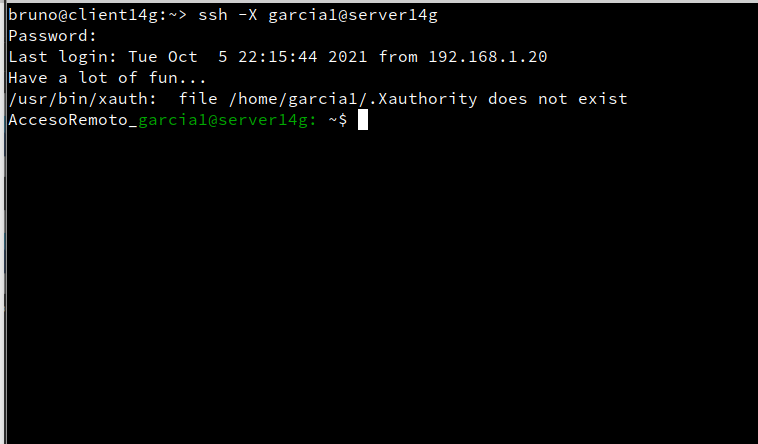

## SSH
Crearemos una maquina linux como servidor, usaremos opensuse, en el añadiremos a hosts los equipos client14g y client14w.
Haremos un ping y unas comprobaciones.

Desde el sevidor haremos un ping a la maquina cliente.

Ahora crearemos los usuarios.

Añadiremos contraseñas.  

En la maquina cliente, después de añadir el server14g a hosts haremos un ping. tambien añadiremos al cliente14w y haremos el mismo progreso.

En la maquina de windows instalamos putty.

Al igual que antes, en windows añadiremos las maquinas y comprobaremos con un ping

Comprobaremos que esta instalado el servicio sshd.

En el equipo client14g haremos un ping al servidor para comprobar y haremos un nmap para ver los puertos.

al acabar entraremos usando
~~~
shh garcia1@server14g

~~~

Usaremos el Putty y tambien entraremos al servidor.

Aqui como podemos ver, en windows nos pide contraseña.

Ahora personalizamos el prompt Bash, en este caso, para el usuario garcia1.

Luego de hacerlo reiniciamos el servicio y comprobamos.

Ahora crearemos una autentificación mediante claves públicas, para ello en el servidor iremos al terminal y generaremos un keygen.

En la configuración de ssh habilitamos el host key.

En el cliente copiaremos el id ssh.
Finalmente comprobamos.

Si entramos al cliente de windows, podremos ver que al cliente14w si le exige contraseña pero en el cliente linux no.

Ahora configuraremos el ssh como túnel para X, para ello volveremos a la configuración de ssh e iremos a descomentar X11Forwarding yes. Para poder ver aplicaciones graficas.

Descargaremos en el servidor la aplicacion geany.(Comprobamos que en el cliente no esta.)

Ahora nos conectamos usando el siguiente codigo
~~~
ssh -X garcia1@server14g

~~~
IMPORTANTE: la -X mayúscula.
y al entrar de esta manera ejecutamos Geany.

Haremos lo mismo pero con aplicaciones con windows como Wine.

Para continuar, Crearemos Restricciones de uso, usando el Usuario garcia2, para ello en el servidor, iremos a la configuración de sshd y usando *DenyUsers*.

Usando el siguiente codigo, comprobamos que el sintaxis es correcto, para ello veremos que si la respuesta es 0 es correcto.

# Servidor SSH en Windows
En windows podremos configurarlo de manera que pueda usar OpenSSH. Primero crearemos una maquina windows server 2016.

Despues de descargar OpenSSH y guardarlo en program files. Iremos a una consola de powershell.
Pondremos el codigo que se ve en la captura.

Antes de instalar añadimos los clientes en el hosts del server windows y viceversa.

Finalmente instalamos el Openssh, y lo configuramos como se ve.

Añadiremos una regla al firewall para ssh.

Definiremos que el servicio funcione siempre, tanto el sshd como el ssh-agent.

Iniciamos el servicio.

Comprobamos en ambos clientes.

