# Introducción VNC

Configuramos las maquinas virtuales según el documento que se especifica en la practica
además configuraremos las IPs.

 ## ***WINDOWS***

Primero configuramos el servidor.
Descargaremos la aplicación *TightVNC* cuando estemos en el instalador seleccionamos *custom* y solo instalaremos el servidor.

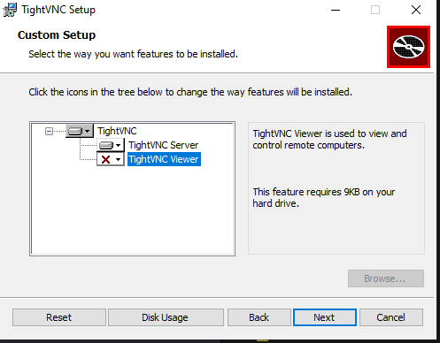

> Es interesante que al acabar la instalación, se compruebe el firewall

En una maquina con linux usaremos nmap -Pn 172.19.14.12 para comprobar que los servicios son visibles.

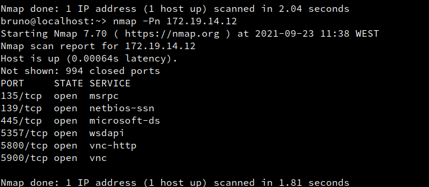

Luego en el cliente de windows instalamos el "*viewer*", para ello en el instalador entraremos en *custom* y luego seleccionaremos *Viewer*.

Comprobaremos ahora que se conectan para ello primero abrimos el programa y ponemos la ip del servidor, en caso de que no entre, pondremos *:1*.

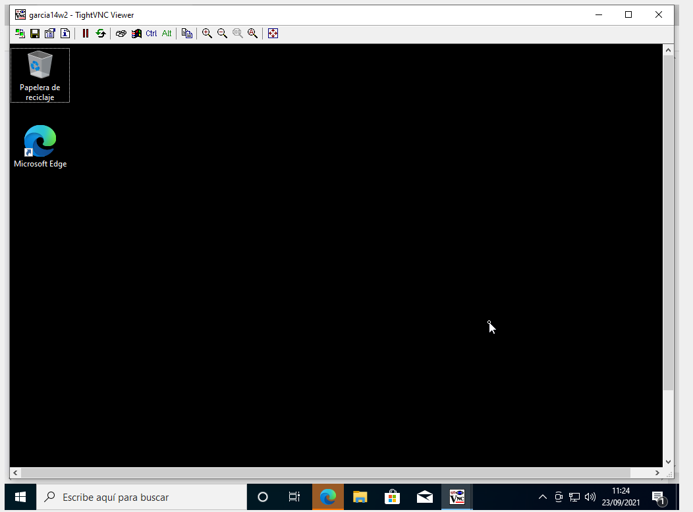

Entramos la consola del equipo servidor y realizaremos un netstat -n para ver la conexion.

## ***Linux***

Iremos a yast y a *VNC* y permitimos la conexion remota, además permitiremos los puertos para el firewall.

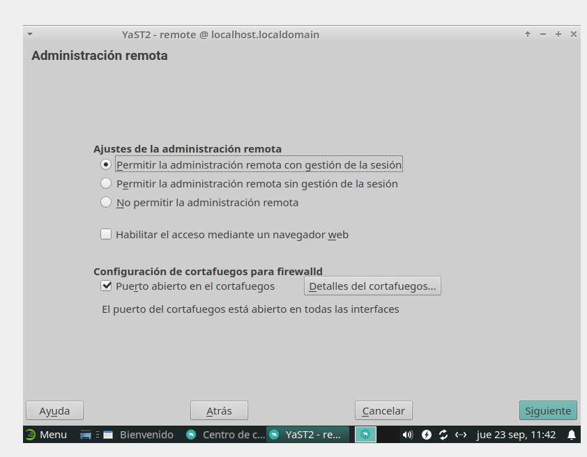

Luego en el usuario normal iremos a una consola y pondremos **vncserver** configuramos los que se nos pide.

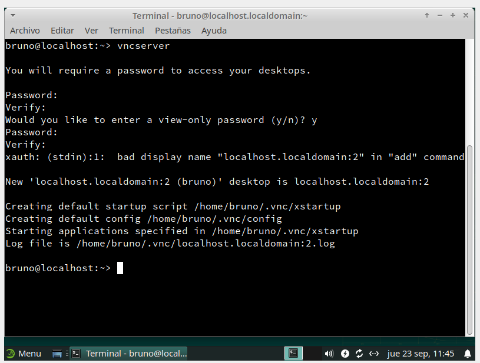

Ejecutaremos un Vdir a .vnc, un ps-ef y un lsof para realizar comprobaciones.

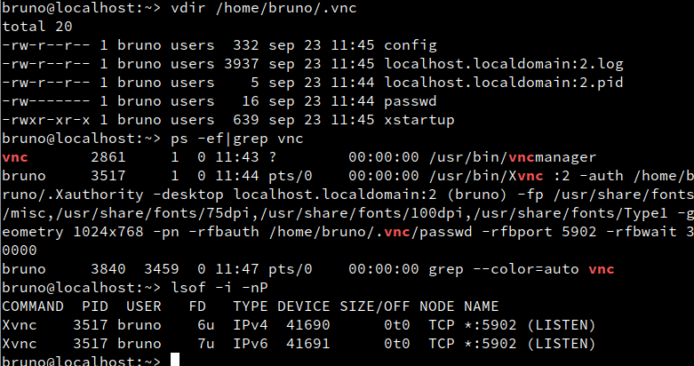

Al igual que antes iremos a una maquina linux y relizaremos un nmap al servidor.

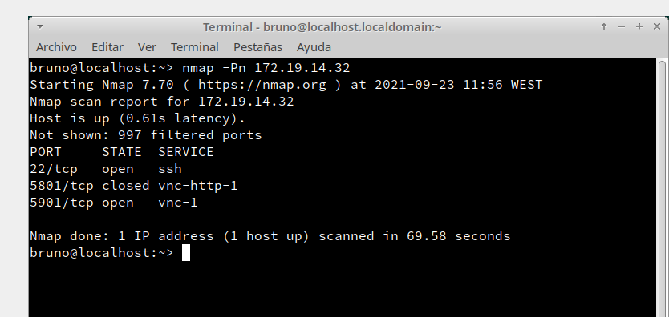

Luego iremos al cliente y en un terminal pondremos "vncviewer" luego se nos desplegará una ventana en la que pondremos la IP del servidor y el nombre del puerto (a veces con solo poner el número final *1, 2, 3...* suele funcionar). Al conectar haremos un lsof y ejecutaremos vncserver -list.

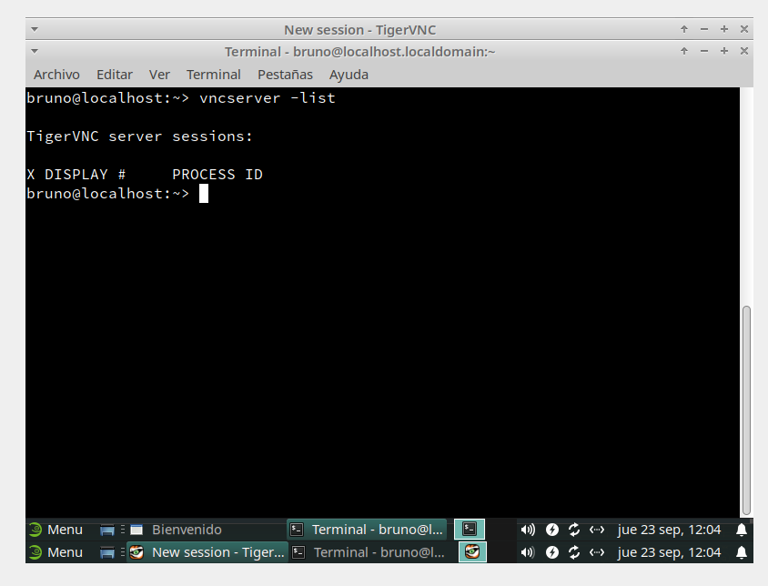

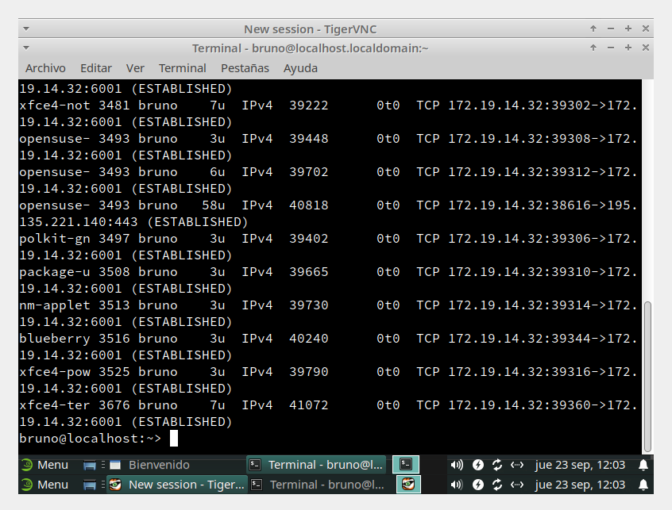

## ***Sistemas Operativos Cruzados***

 Ahora conectaremos windows a linux para ello en el windows cliente abriremos el *Viewer* y pondremos la ip del servidor linux y haremos las comprobaciones necesarias.

 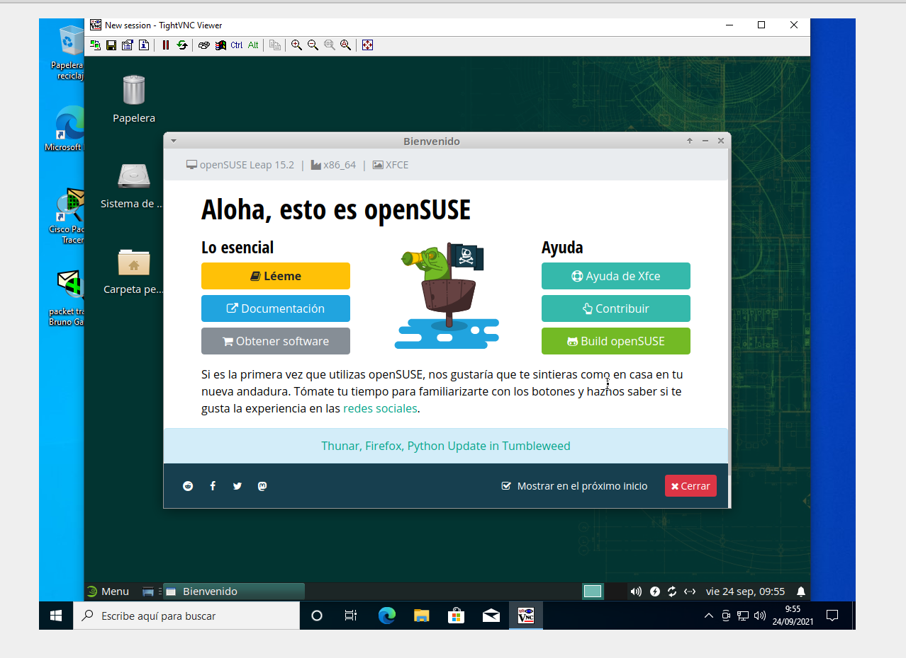

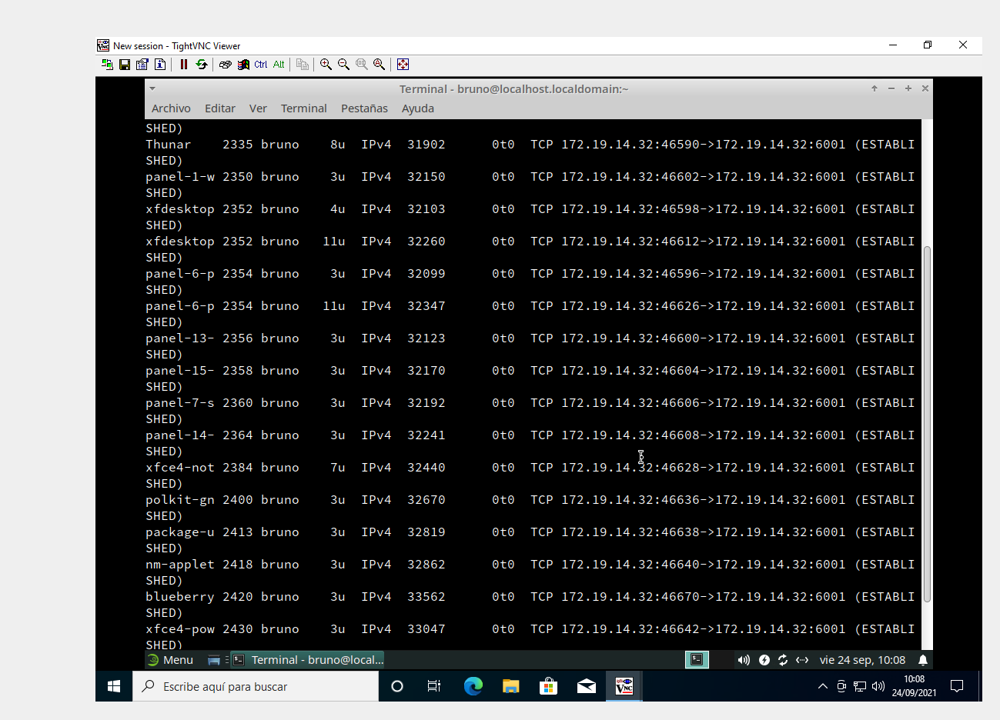

Despues conectaremos Linux con windows, iremos al cliente linux y en el terminal pondremos *vncviewer* y pondremos la ip del servidor windows y haremos las comprobaciones.

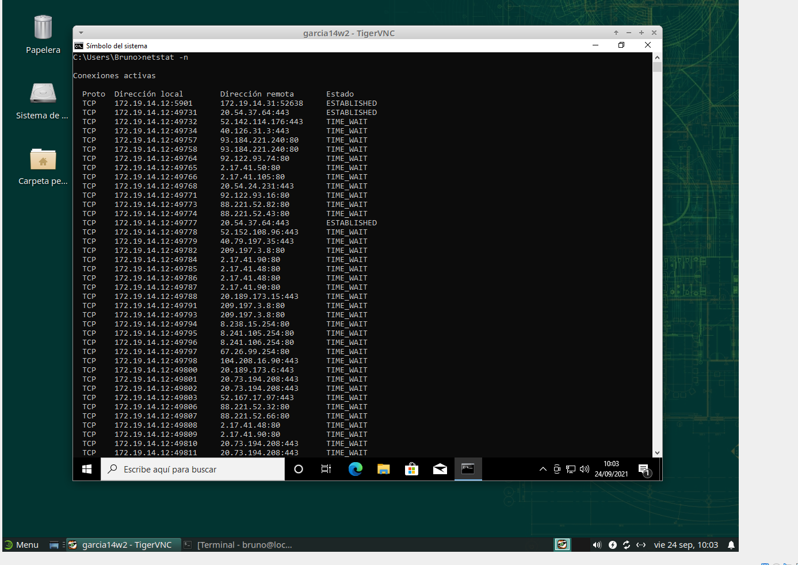
>En esta captura vemos corriendo netstat -n la otra captura se ve la conexion.

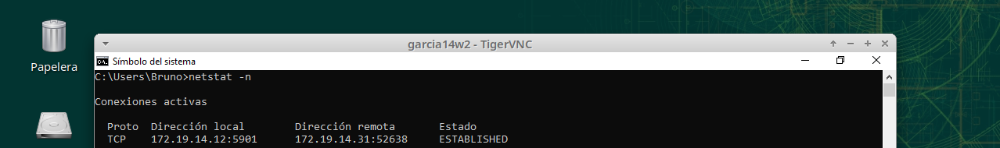

## ***DISPLAY 0 OpenSuse***

Anteriormente para entrar en la maquina linux necesitabamos entrar con la sesión cerrada para poder hacerlo con la sesion abierta usaremos "*x0vncserver -display :0 -passwordfile /home/bruno/.vnc/passwd.*" en un terminal del servidor, luego iremos al cliente y entraremos.

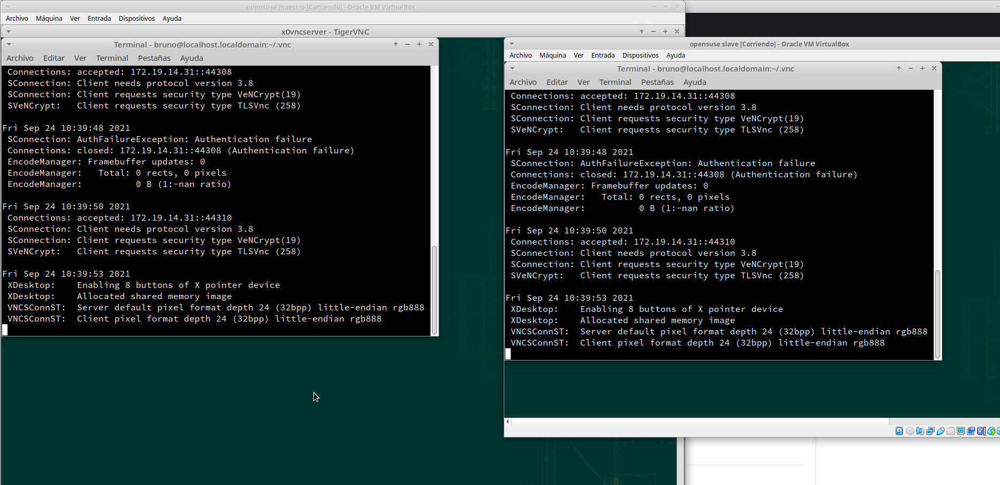
