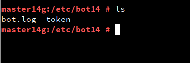
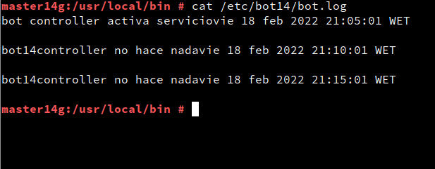

# Servicio de comunicaciones con telegram (bot-service)

- ***Nombre:*** Bruno García Fernández
- ***Curso:*** 2º de Ciclo Superior de Administración de Sistemas Informáticos en Red.

### ÍNDICE
+ [Inicio](#id0)
+ [Systemd](#id1)
  + [crear un servicio](#id2)
  + [iniciar y activar el servicio](#id3)
  + [Parar el proceso](#id4)
+ [Programar tareas](#id5)
  + [Controlador](#id6)
  + [Tareas programadas](#id7)

#### ***Inicio***.
En está práctica se divide en la creación de un Bot de Telegram, de crear un "Daemon" y luego programar un Bot con tareas. El Bot podremos verlo funcionando en el directorio multimedia de esté GitHub y el Bot en la carpeta script -> carpeta 1.

Está práctica la entrega se divide en tres formas distintas. El informe irá enfocado a los puntos dos y tres estipulados en la prácticas.

#### ***Systemd***.
Systemd es un conjunto de demonios o Daemon de administración de sistema, bibliotecas y herramientas diseñados como una plataforma de administración y configuración central para interactuar con el núcleo del Sistema operativo GNU/Linux.

Vamos a crear un servicio para nuestro Bot, de modo que se inicie siempre al arrancar el equipo y que podemos gestionarlo como el resto de servicios (usando el comando Systemctl).

#### ***crear un servicio***.

Usando el Bot que creamos para la primera entrega:

+ Copiaremos el script del Bot a la ruta `/usr/local/bin/bot14d` y lo haremos ejecutable usando `chmod`.

+ Crearemos el directorio `/etc/bot14`.

+ Creamos el fichero `/etc/bot14/token`. En el guardaremos el token que nos deja el "BotFather" a la hora de crear el Bot en el punto uno.

(No muestro el token ya que es privado)

Luego en el script del Bot, para que lea el token deberemos añadir la siguiente línea.

Ahora vamos a crear el fichero "bot14.service", lo vamos a alojar en `/etc/Systemd/System/` para preparar el bot como un servicio.

> El init es el proceso que inicia todo el sistema y arranca los servicios. Cada sistema operativo puede tener distintos "init" como Systemd, SystemV, Upstart, Openrc, etc. Nuestro sistema operativo viene con Systemd, así vamos a configurar Systemd para gestionar nuestro servicio.

El fichero contendrá el siguiente contenido:

#### ***iniciar y activar el servicio***.

Iniciaremos como ROOT y haremos una serie de tareas:

+ `Systemctl status bot14` para ver que el servicio esta inactivo.
+ `Systemctl start bot14` para iniciar el servicio.
+ `Systemctl  status bot14` para ver que está el servicio ya está activo
+ `Systemctl enable bot14` para activar el servicio y que al arrancar la máquina se active.

Reiniciamos la máquina y al consultar con `Systemctl status bot14` veremos que está activo el servicio.

#### ***Parar el servicio***.

La opción más cómoda a la hora de parar un servicio es usar `Systemctl stop` pero podemos parar los servicios tambien usando el comando `Kill`

>En Unix y los sistemas operativos tipo Unix, kill es un comando utilizado para enviar mensajes sencillos a los procesos ejecutándose en el sistema. Por defecto el mensaje que se envía es la señal de terminación, que solicita al proceso limpiar su estado y salir.

Primero debemos encontrar el identificador del proceso (o PID) de "bot14", usaremos `ps -ef | grep bot14d`.

Para saber cual es el nuestro nos bastará con mirar cual es el que posee la ruta al Bot.

Luego simplemente usamos `Kill -9 PID` con esto ordenamos al proceso que "muera".

Para comprobarlo podemos hacer lo que se ve en la captura.

#### ***Programar tareas***.

Ya sabemos como configurar nuestro programa Daemon para que se comporte como un servicio, y además para que se inicie de forma automática al iniciar la máquina.

Supongamos que nos preocupa que nuestro programa (bot14d) se pueda detener de forma inesperada y no nos demos cuenta. Vamos a crear otro script que se va a encargar de iniciar el demonio si se para. Este script va a controlar el demonio cada 5 minutos.

#### ***Controlador***.

Crearemos un nuevo script en `usr/local/bin` llamado "bot14controller"

El script de a continuación tiene las siguientes características:
primero con una variable llamada, "date" ejecutaremos el comando `date` del sistema y nos dará la fecha y hora. Luego concatenamos "date" con dos nuevas variables, "msg1" y "msg2", en ellos pondremos un mensaje. a continuación condicionaremos, `Systemctl is-active bot14` para que, en caso de que sea "*true*", nos indique por pantalla que el servicio esta activo, y usando  `echo` nos guarde la variable anterior en un archivo que hemos llamado, "bot.log" para poder guardar constancia de que el bot está funcionando o si se ha tenido que activar el servicio. En caso de que sea "*false*", ejecutará `systemctl start bot14` y nos activará el servicio.

En `etc/bot14` crearemos el fichero `bot.log`.

#### ***Tareas programadas***.

Vamos a programar el script bot14controller para que se ejecute cada 5 minutos. Usaremos la herramienta crontab.

Iniciamos como root, y editaremos crontab usando `crontab -e`, se nos abrirá un editor `vim`, presionamos "i" para insertar información y escribiremos el siguiente comando:

~~~
*/5 * * * *  ruby /usr/local/bin/bot14controller
~~~

Es importante el `*/5` ya que si solo dejáramos `5` estaríamos indicando que queremos que a las y cinco minutos de cada hora se ejecuté y queremos que se ejecuté cada 5 minutos. El programa debe tener primero "Ruby" delante si "bot14controller" esta hecho en Ruby.

Ahora paramos el servicio y esperamos cinco minutos.

Para ver que efectivamente se ha hecho cada cinco minutos iremos a `/ect/bot14/bot.log` y vemos que efectivamente se ha hecho cada cinco minutos. 

