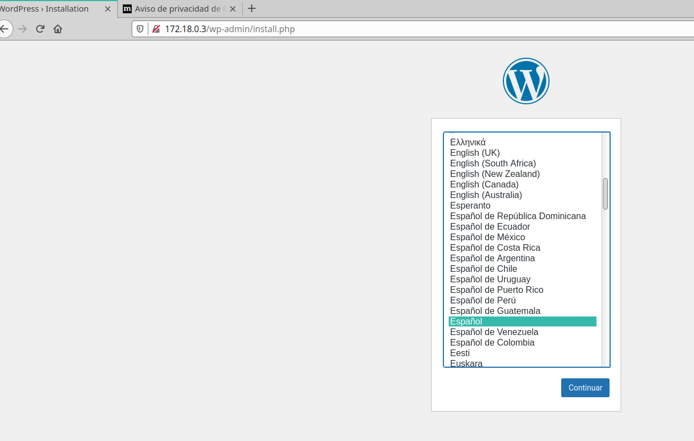

# Docker-Compose

***Nombre:*** Bruno García Fernández

***Curso:*** 2º de Ciclo Superior de Administración de Sistemas Informáticos en Red.

### ÍNDICE

+ [Docker-Compose](#id1)
+ [Gestionar un contenedor Nginx](#id2)
  + [Gestionar Nginx con un volumen](#id3)
+ [Gestionar un contenedor MYSQL con volumen](#id4)
+ [Gestionar dos contenedores](#id5)

# ***Docker-Compose***. 

Docker Compose es una herramienta que permite simplificar el uso de Docker. Facilitando el diseño y la construcción de servicios o de aplicaciones con múltiples componentes.

Lo que haremos en primer lugar será instalar docker-compose, para ello primero usado el comando

~~~
zypper install docker-compose
~~~

Para comprobar que esta instalado usaremos el comando:

~~~
docker-compose -v
~~~

# ***Gestionar un contenedor Nginx***. 

Usando `Docker images`, consultaremos las imagenes instaladas.

Ahora no aparece ninguna por que no hay nada instalado.

Buscaremos en docker de nginx, usando: `docker search nginx`,

Para descargarlo usaremos `docker pull nginx`

Al descargarlo usando otra vez `docker images`

# ***Gestionar Nginx con Volumen***. 

Crearemos la carpeta compose21nginx, dentro de ella otro fichero y finalmente un `.html`, en que incluya el nombre y número de puesto de trabajo.

Dentro de la carpeta anterior crearemos un docker-compose.yaml con el siguiente contenido:

Usamos `docker-compose config` para ver si hay algún error

Usamos `docker-compose ps` y comprobamos que todavía no se ha creado el contenedor.

Luego usaremos `docker-compose up `y Comprobamos.

Ahora haremos un cambio en caliente, para ello iremos al html y añadiremos una linea de texto, en el navegador le daremos a `f5` y comprobamos el cambio

Yendo a un segundo terminal, usaremos `docker-compose down` para apagar el terminal

Usaremos `docker-compose ps` para ver que esta el servicio apagado.

# ***Gestionar un contenedor Mysql con volumen***. 

Vamos a descargar un contenedor con Mysql, luego de descargarlo, crearemos una carpeta llamada "compose14mysql" y otro dentro de este con el nombre `/data`

Al terminar, crearemos otro documento de docker con el siguiente argumento:

en el fichero definiremos la carpeta /data como el lugar de almacenamiento.

Usaremos `Docker-compose up`.

La primera comprobación será ver si el puerto de mysql esta abierto.

Entramos a mysql, crearemos una base de datos con el nombre "Alumno14" y luego usando `show databases`, veremos las bases de datos que hay.

Nuevamente, apagaremos el servicio.

Comprobamos que esta apagado.

Ahora vamos a comprobar la persistencia de los datos en mysql, para ello levantaremos el servicio y ejecutaremos mysql para ver si esta los datos anteriores.

Comprobamos.

# ***Gestionar dos contenedores***. 

Ahora vamos a tratar de gestionar dos contenedores, en el usaremos una base de datos e instalaremos wordpress, primero crearemos una carpeta con el nombre `compose14wp` y dentro dos subcarpetas y el fichero de docker.

En el fichero de docker usaremos la siguiente estructura.

Arrancaremos docker y comprobamos.

