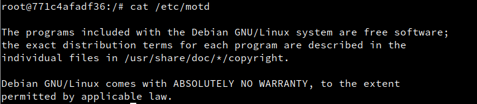

# Docker

Lo primero será instalar docker, y configurarlo de manera que este siempre encendido al arrancar la maquina. usaremos los comandos:
~~~
systemctl start docker
systemctl enable docker
~~~

para comprobar que efectivamente funciona podremos preguntar al fichero ip_forward, si esta activo sale 1.

Crearemos un usuario y lo añadimos al grupo de docker para poder usarlo.

Comprobamos la version de docker.

Ejecutamos docker run hello-world para arrancar el primer programa de docker.

Haremos un docker ps -a para ver que esta el programa corriendo.

Paramos y borramos el "hello world".

Buscamos en docker, debian.

hacemos un pull para coger la imagen.

comprobamos que la tenemos con docker images.

la ejecutamos y nos entrará en una consola de debian.

Instalamos Nginx.

Creamos un html con hola mundo.

Y un programita con una información de Nginx.

Salimos de la consola, hacemos un commit con el nombre que hemos puesto en la imagen.

comprobamos la imagen.

Paramos el docker y borramos.

Ahora ejecutamos nuestra nueva imagen y comprobamos que funciona en el navegador.

Ahora creamos un fichero local con un html con un hola mundo y un fichero Dockerfile con los parametros que el profesor desea.

Lo runeamos.

Comprobamos que la imagen existe

y al correr el contenedor vemos que nos aparece lo que hemos realizado.

Ahora crearemos uno similar y lo subiremos al servidor de docker.

Para acabar borraremos todo. s

