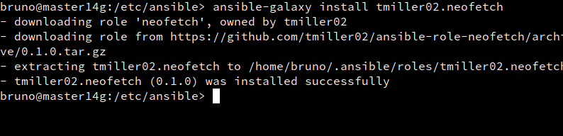

# Ansible

***Nombre:*** Bruno García Fernández

***Curso:*** 2º de Ciclo Superior de Administración de Sistemas Informáticos en Red.

### ÍNDICE

+ [Creado de máquinas](#id1)
+ [Instalación de SSH y Ansible](#id2)
+ [Comandos ad-hoc](#id3)
+ [Playbook](#id4)
+ [Handlers](#id5)

# ***Creado de máquinas***. 

En esta práctica, usaremos dos máquinas OPENsuse y una máquina Windows con la siguiente configuración:

| MVs | Nombre   | Rol    | SO        | IP           |
| --- | -------- | ------ | --------- | ------------ |
| MV1 | master14 | Master | GNU/Linux | 172.19.14.51 |
| MV2 | slave14g | Slave  | GNU/linux | 172.19.14.52 |
| MV3 | slave14w | Slave  | Windows10 | 172.19.14.11 |

(IP del sistema Windows).

(IP del sistema OPENsuse "master").

(IP del sistema OPENsuse "slave").

# ***Instalación de SSH y Ansible***. 

Procederemos a instalar Ansible en MV1.

En las máquinas OPENsuse hemos activado previamente a la hora de instalar la máquina virtual,

*MV1*

*MV2*

Pero a Windows es más delicado, de base no es posible conectarse por SSH por ello tenemos que hacer lo siguiente:

Primero, será instalar la característica, "Servidor OpenSSH".

Y luego deberemos activar en "servicios" los protocolos de OpenSSH, tanto el "Authentication Agent" como "SSH Server"

Tras lograrlo ya podremos entrar por SSH desde MV1 a MV2 y MV3 sin problemas, pero en este caso pedirá contraseña e usuario, por ello nosotros crearemos un par de claves para cada sistema y se las enviaremos usando las herramientas necesarias. (Visto en la actividad de SSH siendo para mi redundante ponerlo).

"Aquí podemos ver las claves públicas-privadas."

Una forma de hacer cómodo todo el funcionamiento de SSH sin contraseña es crear un archivo de configuración:

Esto permite que sea más sencillo conectarnos por SSH y sin tener que especificar usuarios.

En Ansible, existe un concepto llamado inventario. El inventario es el conjunto de máquinas que tenemos declaradas en nuestra instalación de Ansible para informarle al sistema que son aquellas máquinas con las que vamos a trabajar.

En la MV1 crearemos un grupo para alumno con las máquinas. Como Windows y GNU/Linux son diferentes deberemos separar en dos el inventario, para el inventario de Windows le pondremos los pámetros siguientes:

Le asignamos un puerto(5985), le asignamos el servicio de conexión remota (winrm) y un lenguaje (basic).

En la máquina Windows, instalaremos Winrm

>WinRM (Windows Remote Management) es una herramienta que nos permite administrar el Hardware de ordenadores basados en Windows clientes y de Servidores tanto de forma local como remota.

Para Ansible, le instalaremos un lote de programas para poder realizar acciones en windows.

Para comprobar que Windows funciona correctamente usaremos el siguiente comando:
`ansible alumno14w -m win_ping`.

Con él le pediremos por Ansible a la máquina Windows que, realice un ping.

Haremos lo mismo pero ahora con MV2, usaremos `ansible slave14g -m ping`.

>Como se puede ver, hay diferencias entre comandos pero en el fondo funciona igual.

>Me confundi y en vez de usar alumno14 use slave.

# ***Comandos ad-hoc***. 

Los comandos ad-hoc se lanzan desde la terminal y permiten realizar tareas rápidas en un servidor. También pueden ser usados para lanzar instrucciones concretas usando módulos específicos de Ansible en un servidor.

Para continuar con la práctica, instalaremos Neofetch. Neofetch es un programa escrito en lenguaje bash, que permite ver en la terminal la información básica del hardware y del software instalado.

> El programa lo conocimos en la práctica de vagrant.

Lo primero será instalar el módulo de Neofetch en ansible, para ello usaremos el siguiente comando:

En MV2, para poder leer ciertas instrucciones vamos a necesitar el siguiente programa.

Ahora con `ansible slave14g -m zypper -a "name=Neofetch state=present" -b -K`, indicaremos que queremos instalar Neofetch en la MV2.

El color naranja indica que se han efectuado cambios, si volvemos a lanzar el mismo comando que antes, nos aparecerá en verde, indicando que efectivamente está instalado

Ahora para comprobar, nos meteremos por SSH a la máquina MV2 y veremos que esta instalado Neofetch, para ello podemos usar  `zypper se neofetch` o usar el programa.

# ***Playbook***. 

La forma reutilizable de usar Ansible es escribiendo playbooks, que son archivos en los que declaramos las tareas que necesitamos hacer con nuestro servidor que vayamos a aprovisionar.

En la MV1 creamos el directorio `/home/bruno/ansible14.d`.

Dentro de esta carpeta, crearemos un archivo, `tarea-41-ping.yaml` y en el añadiremos lo siguiente.

En el archivo indicamos que vamos a hacer ping.

al ejecutarlo, podremos ver que ha hecho un cambio (eso en este caso indica que ha hecho lo que se le pidió con éxito, ya veremos a lo largo de la práctica cuando instalemos software pruebas más concluyentes).

Antes de continuar, para evitar problemas, vamos a eliminar Neofetch de MV2, va a ser bastante necesario ya que puede darnos problemas que explicaré más tarde.

Crearemos un archivo nuevo en `ansible14.d`, en este caso será `tarea-42-install.yaml`
en él añadiremos los parámetros para instalar:

+ Neofetch
+ Audacity
+ Discord

Lo ejecutamos usando `ansible-playbook tarea-42-install.yaml -b -K`  y comprobamos si está instalado.

Al entrar por SSH y usar `zypper se XX`(XX es el programa en cuestión), podemos ver  esta instalado.

>Aclaratoria, al usar el comando zypper search (o zypper se para abreviar) si el paquete que buscamos está instalado veremos a la izquierda una i o i+, eso indica que, efectivamente esta instalado, en caso contrario no aparecerá nada.

Pero, ¿y si no necesitáramos más esos programas? Para ello Ansible, y su Playbooks nos ayudan.

Crearemos un fichero nuevo, `tarea-43-uninstall.yaml`, que tendrá el siguiente contenido:

Lo ejecutamos usando `ansible-playbook tarea-43-uninstall.yaml -b -K`  y comprobamos si está instalado.

Si nos conectamos por SSH, y volvemos a ejecutar `zypper se XX` podemos ver que ya no está instalado.

# ***Handlers***. 

Los Handlers son funciones que poseen los playbook, sirven principalmente para disparar la ejecución de más tareas cuando una tarea previamente descrita en la sección tasks se ejecuta de forma satisfactoria provocando cambios, es muy como para, por ejemplo levantar servicios como apache o nginx.

Dentro de la carpeta `ansible14.d` crearemos un nuevo archivo `.yaml`, en este caso crearemos uno enfocado a la creación y encendido del servicio de Apache2.

Si lo hiciéramos de forma convencional, sería mucho menos efectivo y propenso a errores ya que si por cualquier motivo falla la primera "task" la siguiente trataría de funcionar y daría errores, con Handlers, si falla la primera "task", no continua.

> task: tarea

Con el `yaml` creado estamos indicando:
+ Que use otro usuario que no sea el "por defecto" si no que use root
+ `become = true` permite que no pida contraseña.
+ Que instale Apache2
+ Tras instalarlo que lo active.

luego de guardarlo como `tarea-52-apache2-on.yaml` lo ejecutamos como un playbook normal.

Al finalizar, vemos que a hecho los cambios que hemos solicitado y handler se ha disparado correctamente.

Ahora, al igual que antes, entramos en la máquina MV2 por SSH y comprobaremos que el servicio está funcionando.

Ahora, eliminaremos Apache2, en este caso volvemos a la MV1 y en la carpeta de ansible, creamos otro fichero `.yaml` en este caso tiene el siguiente objetivo:

+ Primero parar el servicio con una "task" normal
+ Luego desinstalar Apache2 con handlers.

Luego de guardarlo como `tarea-53-apache2-off.yaml`, lo ejecutamos

Al entrar a por SSH y al usar `zypper se apache2` vemos que efectivamente, ha sido desinstalado.

> Tanto el apartado 6, como la instalación de neofetch en windows, por temas de tiempo entre mi y mis compañeros ha sido imposible completarlos, espero que comprenda la situación.
