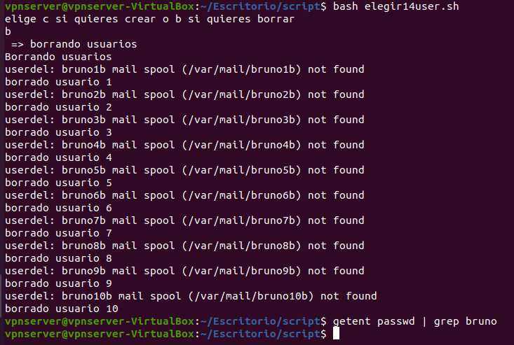
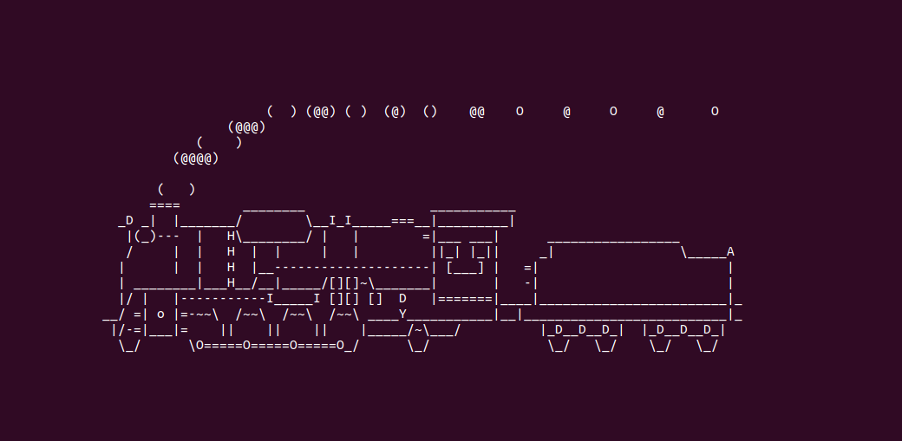

# Scripting: Estructura condicional

- ***Nombre:*** Bruno García Fernández
- ***Curso:*** 2º de Ciclo Superior de Administración de Sistemas Informáticos en Red.

### ÍNDICE
+ [Práctica de Bash condicional](#id1)
  + [Práctica de Bash condicional con variable fija](#id2)
  + [Práctica de Bash condicional con argumentos](#id3)
+ [Práctica de Ruby condicional](#id4)
  + [Práctica de Ruby condicional con variable fija](#id5)
  + [Práctica de Ruby condicional con argumentos](#id6)
+ [Mejorar con código de salida (Bash) ](#id7)
+ [Mejorar con código de salida (Ruby)](#id8)

#### Práctica de Bash condicional.

Con Bash vamos a crear "Scripts" condicionales. Los condicionales te permiten variar el resultado de tu script en función de las condiciones que establezcas.

Vamos a crear usuarios o borrarlos en función de la necesidad que tengamos, para ello tenemos el siguiente script:

El siguiente script usamos ciertos elementos como son `if` para definir la condición, `else` que sirve para que en caso de que el `if` no se cumpla, se ejecute y `elif` que, es parecido al `else` con la particularidad de permitir ejecutar otra condición, también usamos `read` que nos servirá como entrada de datos. En este script, usando los script secuenciales de la práctica anterior como ejecución, escructuraremos para que luego de ejecutar el script, nos pida una letra, que sea "c" para crear "b" para borrar, y en caso de que se ponga cualquier otra letra nos lance un mensaje.

Antes de hacer las comprobaciones vamos a hablar de `getent passwd`, este comando sirve para ver todos los usuarios del sistema y el tipo de Shell. Es parecido a usar `cat /etc/passwd` aunque el anterior es mejor por el hecho de que es menos caótico a la hora de ejecutar, por ello, vamos a usar el comando `getent passwd` luego de ejecutar el script para comprobar que los usuarios se crear y se borran correctamente. Guardaremos el script con el nombre `elegir14user.sh`

Creando usuarios:

Borrando usuarios:

Error:

> El comando SL lo pondré solo para esta parte ya que es una locura replicarlo en cada uno.

#### Práctica de Bash condicional con variable fija.

En los condicionales tenemos varias formas de interactuar con el script para ejecutar lo que deseamos. Un ejemplo de ello es introducir manualmente la entrada o `input` que íbamos a usar.
En el siguiente script reemplazaremos el `read` por la variable que debía ser leída, en este caso "option". Guardamos el script con el nombre `elegir14var.sh`

Al ejecutarlo podremos ver que en vez de pedirnos una entrada, leerá la que ya tiene guardada y ejecutará la opción elegida (En este caso, crear usuarios.)

#### Práctica de Bash condicional con argumentos.

Como mencionamos antes, tenemos varias formas de interactuar con el script, una de las más cómodas en a mi punto de vista es mediante argumentos ya que los argumentos nos permiten solo escribir el `input` que necesitemos y listo.

En el script anterior vemos que no le decimos que lea ni reemplazamos nada, simplemente añadimos a los `if` el argumento que necesitamos.

Para ejecutarlo simplemente será `NOMBRE-SCRIPT "ARGUMENTO"` en este caso será `elegir14arg -c` para crear usuarios o  `elegir14arg -b`.

Comprobamos.

#### Práctica de Ruby condicional.

Ahora, pasamos a Ruby, el script hace exactamente lo mismo simplemente usamos la sintaxis de Ruby.

Para el script siguiente, ser lo mismo que su acopio de Bash, en este caso en ves de usar `read` pondremos la variable como tal y añadiremos `gets.chomp` que hace las de `read` para Ruby. Lo guardaremos como `elegir14user.rb`

> NOTA: en la captura se ve elsif, funciona perfectamente.

Ahora, hacemos las comprobaciones pertinentes.

Creando usuarios:

Borrando usuarios:

Errando en el argumento:

>NOTA: Al igual que antes, no voy a repetir SL.

#### Práctica de Ruby condicional con variable fija.

Como vimos antes, podemos introducir la variable que deseemos manualmente y de manera fija en el script. Este método es eficiente en algunos campos pero en el ámbito general es muy prescindible, generalmente no te compensa crear un archivo fijo con variables (Todo esto hablando a nivel de usuario en niveles profesionales seguramente tenga un componente crucial para algunas tareas de automatización).

Copiamos el script anterior y le borramos el `gets.chomps` para añadir la variable que deseamos. Guardamos el archivo como `elegir14var.rb`

Comprobamos.

#### Práctica de Ruby condicional con argumentos.

Sin variar en exceso lo hecho en Bash, haremos un script condicional en el que usaremos argumentos, para que funcione en `option` añadimos `ARGV` para que entienda que debe leer lo que viene después de ejecutarse (es decir que cuando escribimos en el terminal `NOMBRE-SCRIPT-ARGUMENTO` y le añadamos el argumento que queramos lea ese argumento). Para asegurar su funcionalidad le he añadido `first` esto permite que solo lea el primer argumento. Guardamos este script como `elegir14arg.rb`

Lo ejecutamos usando los argumentos correctos.

Creando usuarios:

Borrando usuarios:

Añadiendo variables incorrectas o no añadiendo ninguna:

#### Mejorar con código de salida (Bash).

El script secuencial que hemos usado no esta mal, pero se puede mejorar infinitamente usando condicionales, por ello vamos a crear un script que lea usuarios, compruebe que existen, en caso de que no los cree y en caso de que estén creados, nos lo notifique y el caso contrario también.

Empezamos con la creación de usuarios, podemos ver que lo que hace el script es, primero lanza un id "user", si no existe es `1` y por lo tanto, se crea, en caso de que ya este creado (es decir `0` ) saldrá el mensaje de el usuario ya existe. También dejaremos preparado un echo que nos indicará el usuario y con `sudo chpasswd` veremos datos de relevancia.

Comprobamos que funciona.

Si queremos borrar usuarios usaremos el mismo mecanismo pero invirtiendo ciertas cosas. En el `if` indicaremos que para que pueda borrar el usuario `$?` debe ser `0`.

Comprobamos.

#### Mejorar con código de salida (Ruby).

En Ruby hacemos lo mismo que en el punto anterior, esta vez definiremos una variable (para crear usuarios será `ok` y para borrar será `ff`) que será preguntar mediante a id por el usuario, si id nos da un resultado negativo "`false`" creará el usuario.

"Comprobación".

Y para borrar será lo contrario, si al preguntar por id de un valor positivo "`true`", borrará el usuario.

