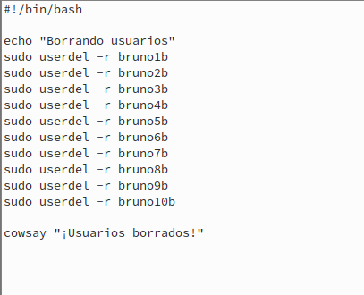

# Scripting

***Nombre:*** Bruno García Fernández

***Curso:*** 2º de Ciclo Superior de Administración de Sistemas Informáticos en Red.

### ÍNDICE

+ [¿Qué es BASH?](#id1)
+ [Creación y borrado de usuario BASH](#id2)
+ [¿Qué es RUBY?](#id3)
+ [Creación y borrado de usuario RUBY](#id4)

# ***¿Qué es BASH?***. 

GNU Bash o simplemente Bash es una popular interfaz de usuario de línea de comandos, específicamente un shell de Unix; así como un lenguaje de scripting. Bash fue originalmente escrito por Brian Fox para el sistema operativo GNU, y pretendía ser el reemplazo de software libre del "*shell Bourne*".​

Bash esta prácticamente en todos los sistemas operativos UNIX, Fue escrito por Brian Fox para el sistema operativo GNU, fue lanzado en 1989 y se ha usado como interprete de inicios de sesión para las distribuciones GNU/Linux y en su momento de MAC hasta la versión 10.15. Una versión de Bash está disponible para Windows 10 y android. El nombre del intérprete es un acrónimo de 'Bourne-again shell' (intérprete de órdenes Bourne, de nuevo).

# ***Creación y borrado de usuarios BASH***. 

Para la creación de los usuarios en Bash primero deberemos indicar su lenguaje, como es bash en la primera línea del script pondremos: `#!/bin/bash`. Luego, escribiremos un mensaje con "*echo*" `echo "Creando usuarios"`. Para continuar usamos comandos, escribiremos lo que queramos hacer y como en este caso vamos a crear usuarios, usaremos los comandos para crear usuarios `useradd -m "user" -p "password"`, (Con la `-m` crearemos los `/home` de los usuarios) al ser una secuencia lo repetiremos con los valores solicitados. Para terminar he usado "cowsay" (un programita que hace que aparezca una vaquita y te lea el mensaje que desees) para que, al acabar el script indique que ha finalizado. Lo guardaremos como `crear-usuarios14.sh`.

Lo ejecutamos yendo o determinando la ruta del script e indicamos el comando de sistema que deseamos que lo lea, como el comando lo hemos escrito con Bash, escribiremos `bash crear-usuarios14.sh`. Si todo va bien, deberá aparecer lo siguiente.

Para comprobar que está efectivamente se ha hecho los usuarios con contraseña, lanzaremos un cat al fichero `/etc/passwd` añadiendo `grep bruno` par ver los usuarios que nos interesan.

En `/etc/passwd` podemos ver los usuarios, pero no la contraseña, pero si vamos al fichero `shadow` si que podremos ver el usuario y su contraseña ligada.

Ahora vamos a crear un script para eliminar los usuarios anteriores, usaremos al igual que antes `Bash` y lo que cambia con el anterior usaremos `userdel -r "user"` para no solo borrar el usuario, si no también su home (gracias al `-m`) para finalizar al igual que antes usaremos "cowsay" para indicar que se han terminado de eliminar los usuarios. Lo guardamos como `borrar-usuarios14.sh`

> No conseguí de ninguna manera eliminar la aparición del mensaje "no crontab for "user""

Lo ejecutamos usando `bash borrar-usuarios14.sh`

Usando `etc/passwd | grep bruno` podremos ver que se han borrado correctamente los usuarios.

# ***¿Qué es RUBY?***. 

Ruby es un lenguaje de programación interpretado, reflexivo y orientado a objetos, creado por el programador japonés Yukihiro "Matz" Matsumoto, quien comenzó a trabajar en Ruby en 1993, y lo presentó públicamente en 1995.

El creador le puso el nombre de Ruby como broma aludiendo al lenguaje Perl. Se llevó Ruby a Java mediante el proyecto Jruby. Ruby es orientado a objetos: todos los tipos de datos son un objeto, incluidas las clases y tipos que otros lenguajes definen como primitivas, (como enteros, booleanos, y nil).

# ***Creación y borrado de usuario RUBY***. 

Lo primero será comprobar que efectivamente esta instalado Ruby en la máquina que estamos trabajando (en OPENSuse podremos tanto usar `zypper search "software"` como `zypper install "software"`).

Al igual que antes, tendremos que indicar que lenguaje vamos a usar y donde se encuentra en el sistema, lo indicamos con el comando `#!/usr/bin/env ruby`, luego tenemos "puts" que siendo "rápidos", es el equivalente en Ruby de "echo", con el daremos el mensaje, `creando usuarios`.
Para indicar lo que queremos que haga en el sistema usaremos `system` y el comando del sistema para crear usuarios (en este caso para diferenciar cuales han sido creado en ruby y cuales en bash añadiremos a estos `"user"Xr`). Lo guardaremos como `crear-usuarios14.rb`.

Ejecutaremos el script usando Ruby, para ello, usaremos `ruby crear-usuarios14.rb`

Al igual que antes para ver tanto los usuarios como la contraseña usaremos `cat /etc/shadow | grep bruno`.

Pasamos al borrado, simplemente en system reemplazamos el comando de creación por el de borrado, en "puts" indicamos que va a ser un borrado y como añadido haremos que el programa "cowsay" nos diga que ha terminado el script. Lo guardaremos como `borrado-usuarios14.rb`.

Ejecutamos.

Y finalmente comprobamos que efectivamente se han borrado.

