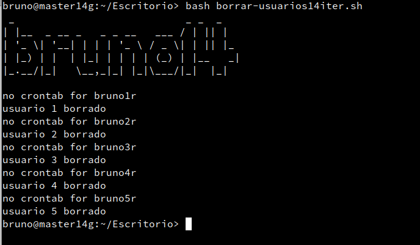

# Estructura iterativa

- ***Nombre:*** Bruno García Fernández
- ***Curso:*** 2º de Ciclo Superior de Administración de Sistemas Informáticos en Red.

### ÍNDICE
+ ["Bash" Creado y Borrado de usuarios ](#id1)
+ ["Bash" Creado y borrado de usuarios con argumentos ](#id2)
+ ["Ruby" Creado y Borrado de usuarios ](#id3)
+ ["Ruby" Creado y borrado de usuarios con argumentos ](#id4)

#### "Bash" Creado y Borrado de usuarios. 

Vamos a iterar, iteración significa repetir varias veces un proceso con la intención de alcanzar una meta deseada, objetivo o resultado. Es distinto de crear una secuencia ya que "iterando" no tenemos que repetir la secuencia en el script sino simplemente preparar el programa para que repita lo que quieras hacer.

Vamos a preparar dos programas, una de creado y otra de borrado de usuarios.

Empezamos con la creación de usuarios pero antes de ir con el script, vamos a explicar un poco algo de sintaxis de iterar. La estructura más simple en "Bash" es la siguiente:
~~~
for "ENTIDAD" in "VALORES" do
    " HACER ALGO CON CADA "ENTIDAD" "
done
~~~

Esto es un bucle usando `for` por ello, con cada entidad tiene un valor, puede ser de un número entero a un rango de valores.

Teniendo en cuenta eso, en el siguiente comando crearemos cinco usuarios, este dato lo expresamos en el `for` usando `{n..n1}` (donde n es el número más bajo y n1 es el más grande) abrimos el bucle con un `do` y dentro pondremos las instrucciones que queremos, como en este caso queremos crear usuarios usaremos los comandos de creación de usuarios de GNU/Linux, para darle un nombre personalizado usando comillas indicaremos `$"ENTIDAD"` y añadirá el valor de la entidad a lo que queramos, en este caso lo usaremos para darle el nombre `"alumno"$1"r"`, Haremos lo mismo para la contraseña y con el `echo`.
cerraremos el bucle con `Done`.

Ahora lo ejecutamos para comprobar que funciona.

Para el borrado vemos que es exactamente igual que para crear, ajustándolo para borrar usuarios.

*Comprobación*

#### "Bash" Creado y Borrado de usuarios con argumentos. 

Ahora rescatado el programa "elegir14arg" vamos a modificarlo para que use los script que hemos hecho antes y vamos a añadirle la opción "e" que usaremos para comprobar que los usuarios se crean o se borrar.

Comprobamos usando -c.

Comprobamos usando -e y vemos que crea los usuarios satisfactoriamente.

Usamos -b para borrar los usuarios.

Y para acabar, usando -e podemos ver que se han borrado satisfactoriamente.

#### "Ruby" Creado y Borrado de usuarios. 

Vamos con Ruby. Con Ruby prácticamente es igual que con bash, usamos bucles con una entidad y valor para que repita ese valor las veces que queramos. La diferencia es al personalizar el nombre de usuario que para añadir la entidad como valor tenemos que usar `#{entidad}`.

Aquí podemos el archivo para crear usuarios usando ruby.

Y este es de Borrado.

#### "Ruby" Creado y Borrado de usuarios con argumentos. 

Al igual que antes, rescatamos el elegir14arg de ruby y lo modificamos usando los nuevos scripts de creado y borrado, y añadiendo la opción "e"

Ejecutamos el programa eligiendo "c".

Luego eligiendo "e" para comprobar que los usuarios han sido creados.

Ahora borramos los usuarios eligiendo "b".

Y finalmente volvemos a comprobar usando "e"

