# Vagrant

## 1º Instalar Vagrant

Vagrant es una herramienta para la creación y configuración de entornos de desarrollo virtualizados.

Haremos la instalación en la maquina real, de hecho en vez de usar la máquina linux de clase, he usado mi máquina windows 11.

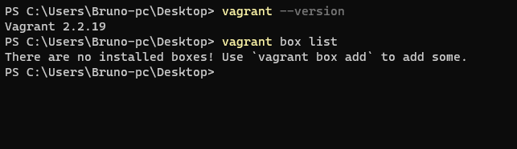

Comprobaremos que vagrant es compatible con la version que usamos en este caso si es compatible.

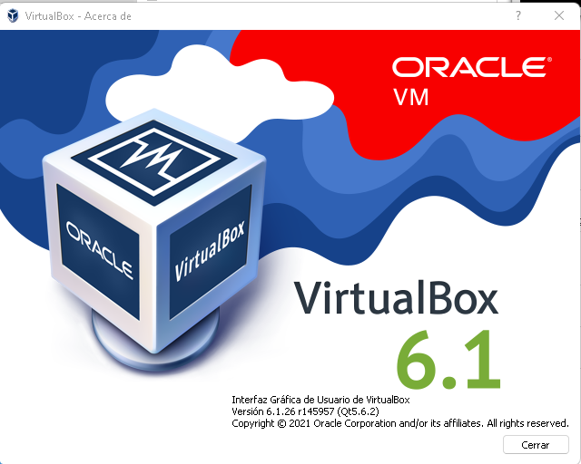

## 2º Proyecto Celtics

Lo primero que haremos será crear el directorio Celtics.

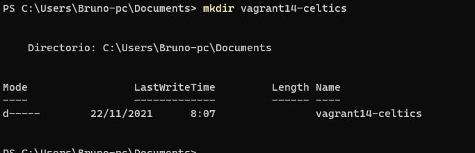

Antes de continuar, añadimos el repositorio de ubuntu para poder trabajar.

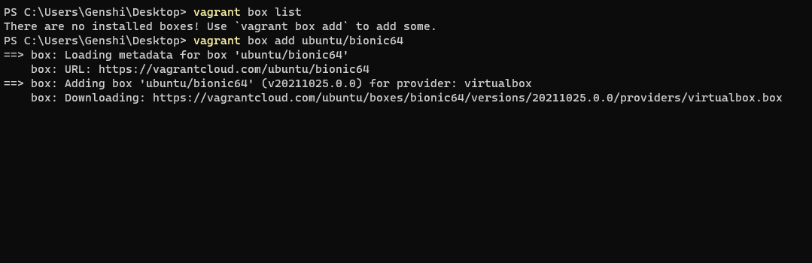

A partir de ahora vamos a trabajar dentro de la carpeta "Celtics".
Creamos un fichero nuevo llamado Vagrantfile con el siguiente contenido:

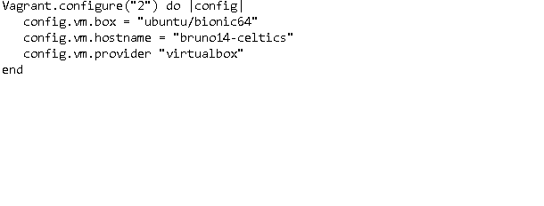

El contenido indica el "box" que necesitamos, el nombre de host y el provedor de "VM".

Para arrancar simplemente escribiremos "*vagrant up*"

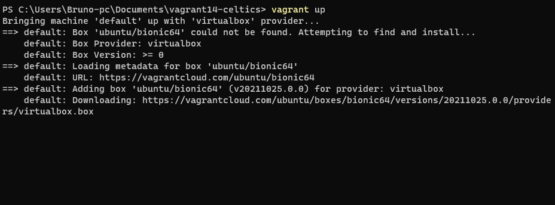

Para poder entrar, vagrant genera claves publico-privadas y con "*Vagrant ssh*" podremos acceder.

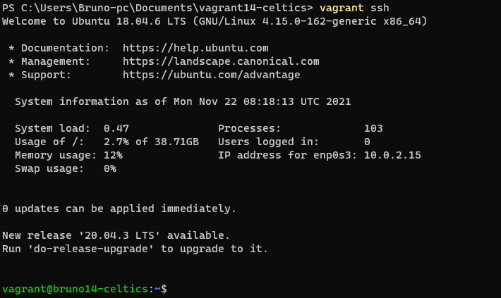

##  Proyecto Hawks

Ahora vamos a hacer otro proyecto añadiendo redirección de puertos.

Crearemos la carpeta siguiente.

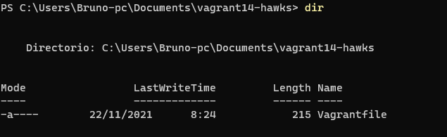

Creamos un "vagrantfile" con el siguiente contenido.

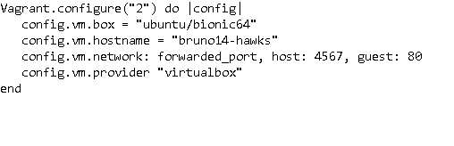

Aqui podemos ver que estamos configurando el network.

Al igual que antes, para iniciar usamos vagrant up, al arrancar nos salta el mensaje de firewall para poder configurar la red.

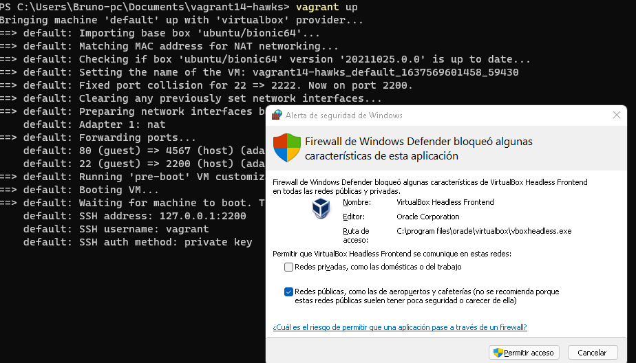

Entramos por ssh y le instalamos apache2

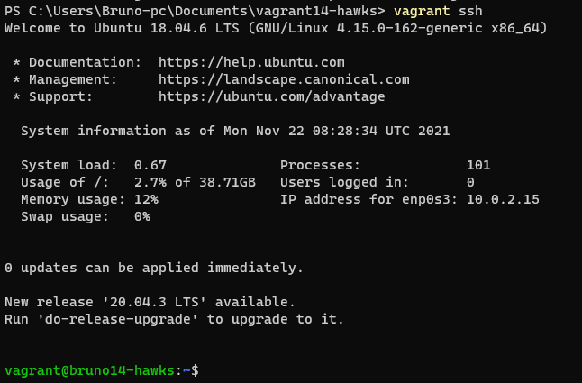

Comprobamos que esta el servicio arrancado.

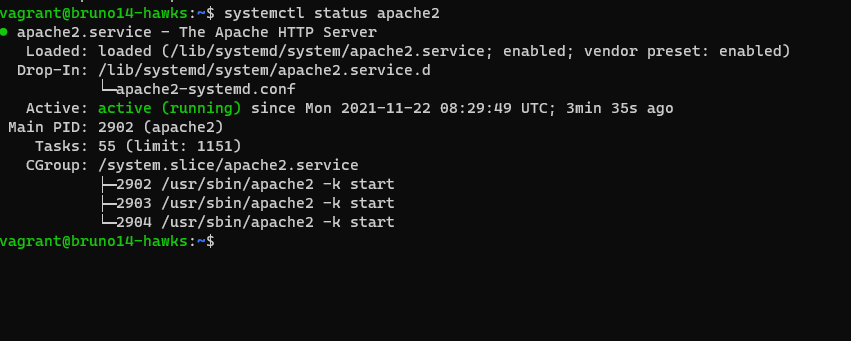

Saldremos a la máquina real, y lanzaremos un vagrant port para ver si los puertos estan abierto.

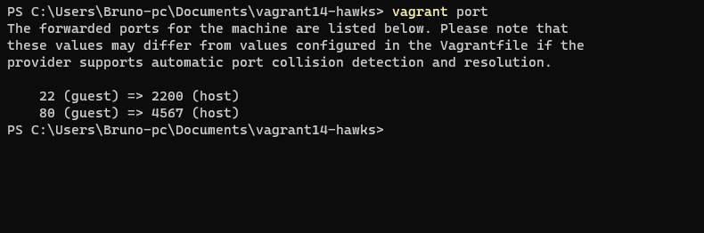

Ahora iremos al navegador y pondremos lo siguiente para ver si podemos ver apache2 de la máquina virtual.

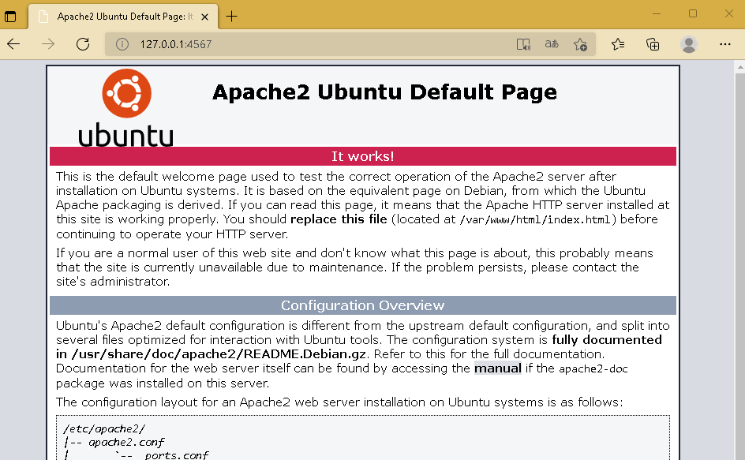

Ahora vemos como borrar las máquinas para tener memoria y poder continuar.

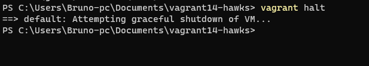

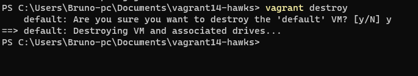

## Proyecto Lakers

Creamos como antes la carpeta Lakers.

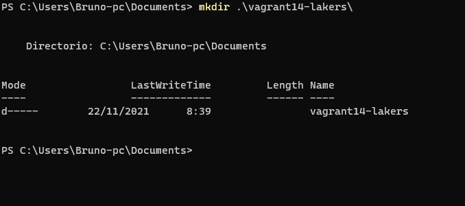

En este proyecto, vamos a suministrar a la MV un pequeño script para instalar Apache.

Crearemos un Html con el nombre del proyecto y nuestro nombre y el siguiente script.

~~~
#!/usr/bin/env bash

apt-get update
apt-get install -y apache2
~~~

Le daremos una extension ".sh", con esto le hemos indicado que debe hacer, en el vagrantfile añadiremos el siguiente script.

~~~
config.vm.provision :shell, :path => "install_apache.sh"
config.vm.synced_folder "html", "/var/www/html"
~~~
Con los dos script anteriores le hemos indicado a vagrant que, instale apache y que añada el HTML al directorio "var/www/html".

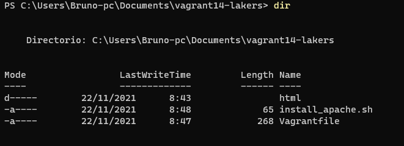

Comprobamos.

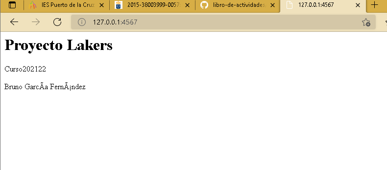

## Proyecto raptors

Ahora usaremos puppet, en el vagrant file añadiremos lo siguiente.

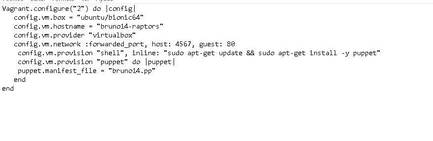

Ahora podemos ver que en apartado "provision" vemos que primero queremos que haga un *update* y luego que instale puppet.

Crearemos una carpeta llamada manifests y en el crearemos un fichero en el que añadiremos lo siguiente:

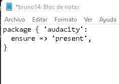

Con esto podremos el programa que querramos instalar.

Y ahora corremos el siguiente programa.

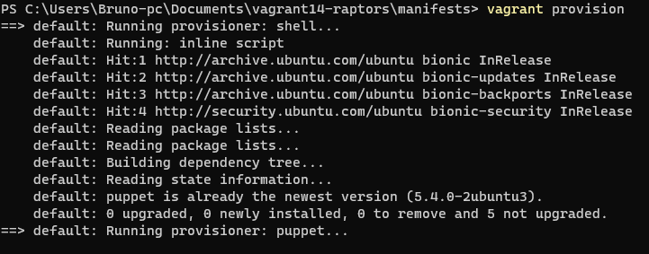

## proyecto bulls

En los apartados anteriores hemos descargado una caja/box de un repositorio de Internet, y la hemos personalizado. En este apartado vamos a crear nuestra propia caja/box a partir de una MV de VirtualBox que tengamos.

Lo primero sera crear una maquina virtual (en mi caso una opensuse) y en el lo primero sera crear un par de claves para vagrant.

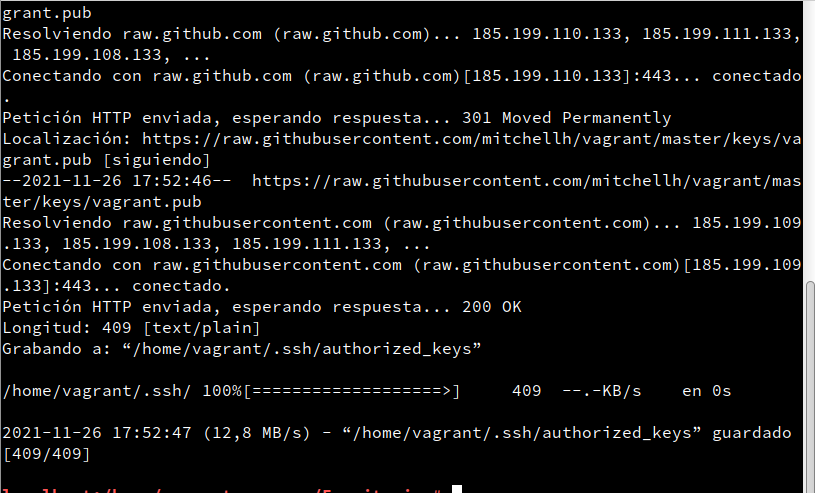

Creamos el usuario vagrant y le damos claves.

Ahora configuramos la maquina dando los permisos que necesitamos.

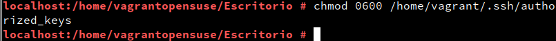

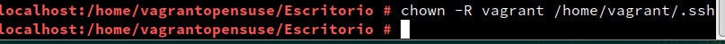

Con el siguiente comando podremos ver la version de las guestadditions.

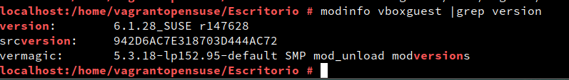

Y en sudoers añadimos y comentamos lo que sea necesario.

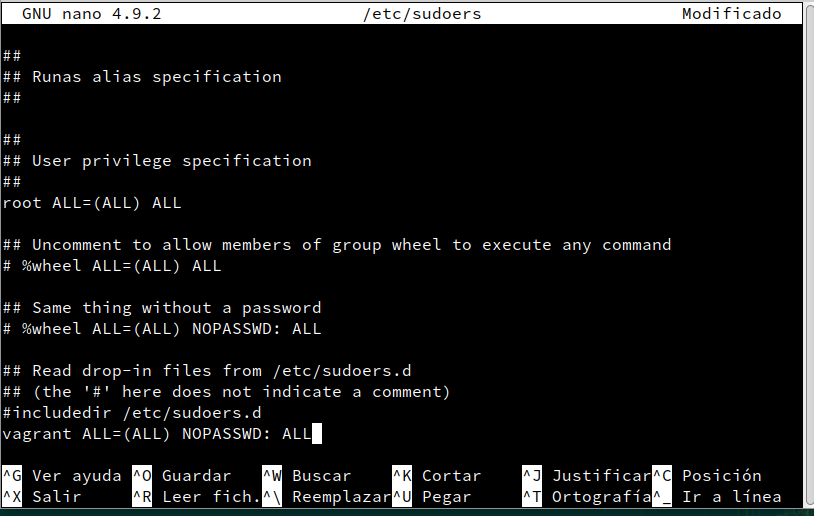

Ahora creamos una carpeta llamada "vagrant14-bulls".

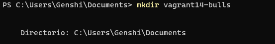

Comprobamos que la maquina esta apagada.

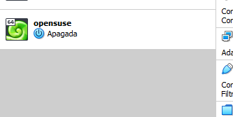

Y crearemos el pack con la maquina.

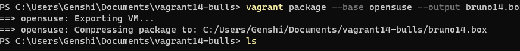

Haremos un vagrant box para ver que está, luego añadiremos la caja que hemos hecho.

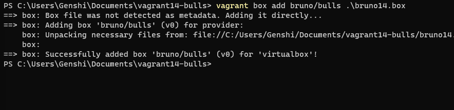

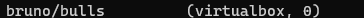

Creamos un vagrantfile y comprobamos.

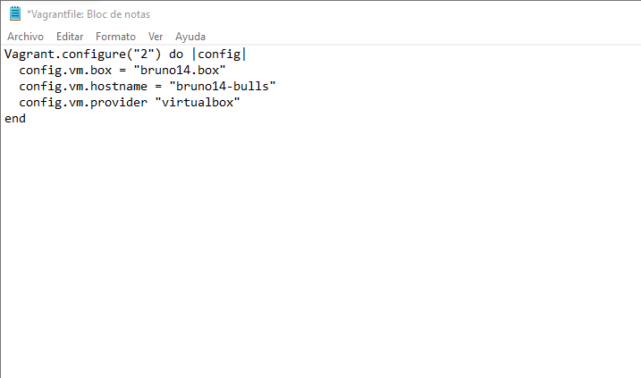

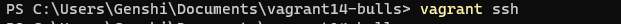
