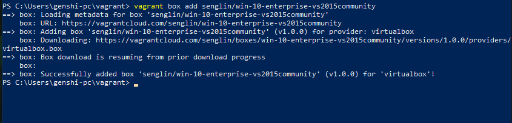

# Vagrant

***Nombre:*** Bruno García Fernández

***Curso:*** 2º de Ciclo Superior de Administración de Sistemas Informáticos en Red.

### ÍNDICE

+ [Instalar Vagrant](#id1)
+ [Proyecto: Añadir cajas](#id2)
+ [Proyecto: Redirección de puertos](#id3)
+ [Proyecto: suministro mediante shell script](#id4)
+ [Proyecto: Suministro mediante Puppet](#id5)
+ [Proyecto: Caja personalizada ](#id6)
+ [Proyecto: Windows](#id7)

## Instalar Vagrant 

Vagrant es una herramienta para la creación y configuración de entornos de desarrollo virtualizados.
Para empezar instalaremos Vagrant, usaremos el instalador que Vagrant nos da para su versión de Windows.

Comprobaremos que Vagrant es compatible con la versión que usamos de VirtualBox. En este caso si es compatible.

## Proyecto: Añadir cajas 

Una de las funciones de Vagrant, es que te permite usar cajas *(imágenes para máquinas virtuales previamente construidas)* creadas por la comunidad, para empezar con esta práctica usaremos una caja de "Ubuntu/Bionic", para obtenerla simplemente usaremos `Vagrant box add "nombre de la caja"`, en este caso la anteriormente mencionada "Ubuntu".

Para comprobar que, efectivamente se ha descargado con éxito, usaremos el comando `Vagrant box list`, nos deberá aparecer el siguiente resultado.

Para empezar a comprender Vagrant, crearemos una primera máquina virtual con la caja anterior para ello, crearemos un directorio llamado `nombreXX-va1box.d`("donde XX es el número de asiento").

Dentro de esta carpeta, crearemos un fichero, este archivo llamado `Vagrantfile` sirve como esqueleto para poder definir parámetros, como por ejemplo el nombre de hosts de la máquina virtual, quién da servicio, que caja usar..., en Windows no es posible crear ese archivo (He buscado un poco, he visto formas pero personalmente no me han funcionado), por ello usando el comando `Vagrant init` podremos crear uno muy completo que podremos usar en la versión de Win10.

Al terminar de definir cada parámetro procedemos a arrancar la máquina, para ello usaremos `Vagrant up`.

Tardará un poco en arrancar pero al terminar, usando el comando `Vagrant ssh`, podremos entrar en la máquina virtual sin ningún problema.

> Podemos ver que nos indica versión, tamaño... Podemos ver que no nos pide contraseña ya que vagrant se encarga de crear claves público-privadas para conectarnos con mayor comodidad.

Al terminar de usar la máquina, podremos salir fácilmente con `exit`.

Las máquinas virtuales ocupan espacio, por ello siempre es recomendable que, si no se va a volver a usar las borremos para ello Vagrant tiene diversos comandos:

+ `vagrant halt` para apagar la máquina virtual.
+ `vagrant status` para comprobar el estado de la máquina virtual.
+ `vagrant destroy` para eliminar la máquina virtual (ojo, borra la máquina pero no los ficheros de configuración, esos deberemos borrarlos manualmente.)

Apagaremos la máquina virtual para luego eliminarla.

Luego comprobaremos el estado de la máquina virtual.

Y finalmente borraremos la máquina virtual. Vagrant por precaución consulta si estás seguro de eliminar la máquina virtual.

## Proyecto: Redirección de puertos 

Ahora vamos a crear un proyecto añadiendo redirección de puertos, esto sirve para si queremos instalar servicios como Nginx, Apache2 entre otros.

Para empezar crearemos un directorio con el nombre  `nombreXX-va3port.d`.

Entraremos en el directorio y en él crearemos otro `vagrantfile` (al igual que antes podemos hacer uso de `vagrant init`.)

Como podemos ver, hemos añadido varias cosas:

+ `config.vm.network :forwarded_port, host: 42XX, guest: 80` esto permite sustituir el puerto 80 por el puerto que decidamos, usando el ejemplo, seria `42XX`(al igual que antes y durante toda la práctica, siendo XX el número de asiento.).
+ `config.vm.define "vagrant-port"` esto hará que la máquina obtenga el nombre definido.
+ `config.vm.provider "virtualbox" do |v| v.memory = 2048` esto permitirá añadir la memoria RAM que necesitemos, siguiendo el ejemplo serían 2048 MB (2GB aproximadamente).

Crearemos la máquina.

Viendo la imagen, podemos ver varias cosas, primero al generar la máquina vemos el nombre que hemos definido, luego, en el recuadro negro vemos que se está redirigiendo los puertos de salida según definimos en el "vagrantfile".

Al entrar en VirtualBox, podemos ver que, efectivamente se ha cambiado el nombre y se ha añadido la memoria establecida.

Nos conectaremos por SSH para comprobar que todo funciona.

Dentro de la máquina virtual, instalaremos Apache2.

Al instalar Apache2 saldremos a la máquina real y usaremos el comando `vagrant port` para ver la redirección de puertos.

En la captura aparecen dos puertos, el 22 y el 80, como podemos ver, el 80 esta redireccionado al que elegimos.

Para finalizar, comprobaremos que la redirección funciona, para ello iremos a un navegador en nuestra máquina local, yendo a la ip `127.0.0.1:4214`, para comprobar que efectivamente funciona viendo la pagina por defecto de Apache2.

Como hicimos antes, apagaremos y borraremos la máquina virtual.

## Proyecto: suministro mediante shell script 

Un aspecto característico de vagrant es el uso de herramienta de suministro, nos permite proveer a una máquina virtual con scripts para, entre otras cosas instalar, configurar, personalizar, y sobretodo automatizar tareas en las máquinas que creamos.

En este apartado vamos a crear varios directorios que serán:

+ `alumnoXX-va4script.d` donde tendremos el `vagrantfile` y un script que prepararemos en breve.
+ `html` Una carpeta que contendrá un `.html` con el que pondremos un mensaje.

Para empezar, vamos a crear el script, con el siguiente argumento:
~~~
#!/usr/bin/env bash

echo "[INFO] Script de instalación de apache2 de [nombre-alumnoXX]"
apt update
apt install -y apache2
echo "[INFO] Fin del script: $(date)"
~~~

para empezar definimos en que lenguaje lo va a leer (bash) haremos que nos envie un mensaje mediante un echo, el programa pedirá una "update" y luego la instalación confirmada de apache2

> Con confirmada me refiero al -y que nos permitirá instalar sin que el sistema pregunte.

Al terminar de instalar nos "printará" en pantalla el fin del script con la fecha.

En nuestro programa, reemplazaremos el `nombre-alumnoXX` por nuestro nombre y asiento.

En la carpeta `html` crearemos un archivo `.html` que llamaremos "index" escribiremos el nombre del proyecto, la fecha y nuestro nombre.

Ahora procedemos a preparar el vagrantfile.

Dentro de este vagrantfile podemos ver varias cosas:
+ `config.vm.provision :shell, :path => "install.apache.sh"` con esto le estamos indicando a Vagrant que debe ejecutar el script que hemos creado previamente dentro del entorno.
+ `config.vm.synced_folder "html", "/var/www/html"` esta línea indica a Vagrant que debe sincronizar la carpeta html de nuestra máquina real, con la carpeta "/var/www/html"
del entorno virtual.

Como hemos hecho a lo largo de la práctica, iniciaremos el servicio con `vagrant up`, como podemos ver marcado, vemos que vagrant a sincronizado la carpeta `html` a donde indicamos y ha ejecutado el script que hemos creado.

Al terminar, para comprobar iremos a un navegador y buscaremos la siguiente IP.

Podemos ver que efectivamente vemos el `index.html` que habíamos creado.

## Proyecto: Suministro mediante Puppet 

Puppet es un orquestador. Sirve para aprovisionar las máquinas locales o remotas sin usar scripting.

Para empezar crearemos un directorio con el nombre `nombreXX-va5puppet.d`.

Dentro del directorio anterior añadiremos la carpeta `manifests`(importante añadir la s al final, de no hacerlo no funcionará correctamente).

Dentro de este último crearemos un archivo,
`nombreXX.pp` y en el añadiremos las siguientes instrucciones Puppet:

El programa que hemos instalado ha sido `neofetch` un programa escrito en lenguaje bash, que permite ver en la terminal la información básica del hardware y del software instalado.

Ahora configuramos el Vagrantfile, como antes, deberemos añadirle ciertas líneas nuevas.

+ `config.vm.provision "shell", inline: "sudo apt-get update && sudo apt-get install -y puppet"` con esta sentencia, habremos indicado que queremos instalar Puppet.

+ `config.vm.provision "puppet" do |puppet|
    puppet.manifest_file = "nombre-del-alumnoXX.pp"` esto permitirá aprovisionar con Puppet desde el archivo que creamos previamente.

Lanzaremos un `vagrant up` para arrancar y un `vagrant ssh` para conectarnos y para hacer comprobaciones.

Si en la máquina lanzamos un `neofetch -ver` veremos datos del sistema y comprobaremos su instalación.

Puede pasar que, debido a problemas o una mala sintaxis, no permita que los parámetros definidos en el vagrantfile u otros archivos que hemos preparado no funcionen adecuadamente, por ello si nos sucede algo similar Vagrant nos permite recargar la configuración
con `Vagrant reload`.

Usando `vagrant provision` podremos volver a provisionar la máquina que estamos ejecutando.

## Proyecto: Caja personalizada 

A lo largo de la práctica hemos usado una caja de un repositorio de Vagrant y le hemos hecho diversas cosas (redirigir puertos, instalarle programas etc...) ahora vamos a algo más interesante, Crear una caja personalizada con una maquina que tengamos.

Lo primero será crear o usar una máquina que tengamos instalada, para esta práctica se ha usado una máquina OPENsuse.

Lo primero será crear un usuario Vagrant, será crucial para que, a la hora de ejecutar Vagrant podamos conectarnos por SSH.

> Usamos el comando `useradd -m` para que nos dé directamente

Para que funcione SSH instalaremos "OpenSSH".

Luego, en el home de Vagrant crearemos una carpeta para SSH, con permisos `700`, después descargamos la clave pública que Vagrant proveé.

Le modificamos los permisos de la carpeta dándole permisos `600` y haremos dueño al usuario Vagrant.

Tenemos que conceder permisos al usuario vagrant para que pueda hacer tareas privilegiadas como configurar la red, instalar software, montar carpetas compartidas, etc. Para ello debemos configurar el fichero /etc/sudoers.

Añadimos la línea `vagrant ALL=(ALL) NOPASSWD: ALL`

Ahora veremos si están las "Guest Additions" de virtualbox añadidas en la máquina.

> Si se usa una máquina OPENsuse 13.5 leap, ya vienen preinstaladas.

Ahora en la máquina anfitriona crearemos el directorio siguiente.

Tenemos que crear el box, usaremos el comando `vagrant package --base VMNAME --output nombreXX.box`

> En VMNAME ponemos el nombre de la máquina que vamos a usar de box.

El proceso puede tardar un poco esperamos, de mientras podemos ir creando el Vagrantfile.

Luego de preparar el Vagrantfile y de terminar de crear el box lo añadiremos a nuestra lista de boxes.

para acabar lanzamos un `Vagrant up` para comprobar que se crea la máquina.

(ACLARACIÓN, Durante la realización de la práctica, tuve varios problemas técnicos, siendo este uno inremediable por lo que, se optó por ver la consola directamente desde VirtualBox.)

Al terminar con algún box viejo o desactualizado, no es conveniente tenerlo guardado, Vagrant, con su comando `vagrant box remove` nos permite eliminar nuestras cajas si no queremos usarlas más.

## Proyecto: Windows 

En Vagrant, no todos son sistemas operativos basados en GNU/Linux, también podremos usar sistemas operativos como Windows, podemos crear una máquina con un windows que queramos o necesitemos o descargar el box de un repositorio en Vagrant. Para este apartado se ha usado una caja de Windows 10 enterprise.

Crearemos un directorio llamado `nombreXX-va7windows.d`

Añadiremos la caja como hemos visto a lo largo de la práctica, en este caso usaremos la descrita en la imagen.

Dentro del directorio crearemos el respectivo Vagrantfile.

Ejecutamos el `vagrant up`

Entraremos por SSH y con el comando `systeminfo` veremos la información del sistema operativo windows.

